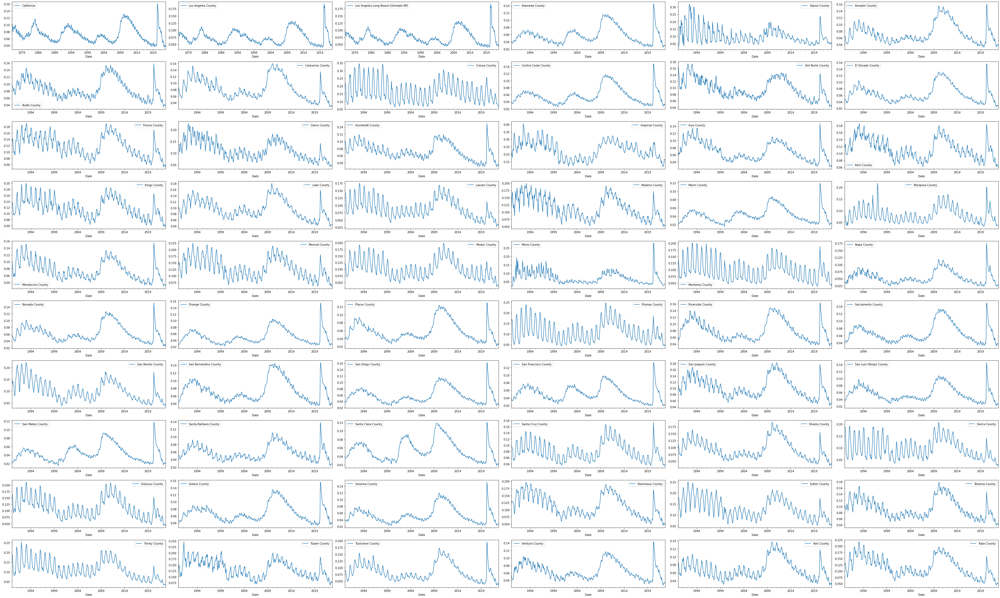
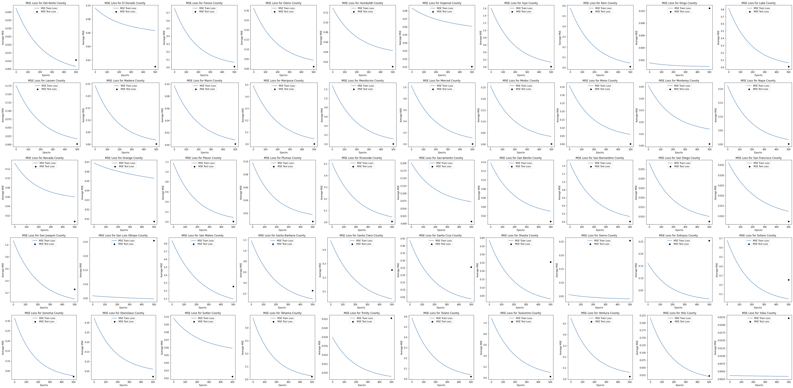

# DeepLearners-California-Unemployment


## Team members:
	Hossein Arjomandi
	Nic Prate
	Tixian Wang
	Zijian Zhen


##  Environment and Dependencies
|Package|Version|
|:---|:---|
|||
|pandas|1.3.5
|pandas-datareader|0.9.0
|sklearn|0.0
|sklearn-pandas|1.8.0
|numpy|1.21.6
|matplotlib|3.2.2
|scipy|1.4.1

To install all requirements:
```bash
pip install -r requirements.txt
```


## Problem explanations:

We are going to use California's unemployment data for the past few decades to predict the ones for the next few years.

## Dataset: [California’s Unemployment Rate ](https://data.ca.gov/dataset/local-area-unemployment-statistics-laus/resource/b4bc4656-7866-420f-8d87-4eda4c9996ed)

|Feature|Description|
|:---|:---|
|||
|Month| month of data source, range from January to December
|Year| year of data source, range from 1976 to 2022
|Date| date of the data source, range from 1976/01/01 to 2022/09/01
|Area Name|categorical feature, totally 1050 different area names.
|Area Type|categorical feature, totally 6 different area types.
|Total Labor Force| number of labor force in the given area
|Employment| number of employment force in the given area
|Unemployment| number of unemployment force in the given area
|Unemployment Rate| Unemployment / Total Labor Force
|Seasonally Adjusted|whether the data is modified to eliminate the effect of seasonal and calendar influences


### Descriptive statistics:
We include the mean, standard deviation, minimum, maximum, and the correlation between `Total Labor Force` and `Unemployment Rate` for each of the 1050 areas and the 4 are types with non-adjusted data. 

You can check the detailed descriptive statistics in the following two links:
* [group by area name](Data/area_name_stat.txt) 
* [group by area type](Data/area_type_stat.txt)
<!-- * [Descriptive statistics group by area name](https://drive.google.com/file/d/1TSYgF4YNSjIez-SfV-YFrfZGcie7aj0m/view?usp=share_link)
* [Descriptive statistics group by area type](https://drive.google.com/file/d/1BfYVFCJYRfRWSnJryO8pJ8ezdBt_g-vR/view?usp=share_link) -->


### Data visualization
Here is the visualization of the historical unemployment rate of 60 selected areas in the dataset.
 

### Data Preparation:
1. Convert Year and Month into timestamps.
2. Convert categorical feature (Area Type, Area) into one-hot encoding.
3. Take Labor Force as another feature.
4. Take Unemployment Rate as target feature.

## Current Results
Here is the MSE loss for Linear Regression models trained on each of the area names, we only show 50 of them.  
 

## Project Timeline and Milestones
### Milestone  10/23/2022:
1.  ~~Zijian: Create a repository with Readme.md as wanted~~
2. ~~Hossein: Convert rows of dataframe to objects of appropriate attributes (one hot encoded, timestamp, integer). Then we have an array of objects~~
3.  ~~Nic: See if we can convert this array of objects to a single dataframe~~
4.  ~~Tixian: See how to pickle an object, be it an array of objects or a dataframe (depending on the answer to 3rd question we may need to pickle a dataframe or an array of objects)~~


### Milestone  11/06/2022:
1. ~~Drop date feature for linear regression.~~
2. ~~Try unemployment rate time series for each area as input for RNN~~
3. ~~Try unemployment rate and labor force in time series for each area as input for RNN~~
4. ~~Consider category data embedding for RNN~~
5. ~~RNN would be a good choice for times series data.~~
6. ~~Each timestamp only has partial observations, how does that work in RNN? What should the data that we feed into the RNN looks like?~~
7. ~~Is that possible if we just take California data as input?~~


### Milestone  11/20/2022:
1. ~~Data visualization and descriptive statistic~~
2. ~~Pickle data for time RNN model.~~
3. ~~Trained Linear Regression model on each of the area.~~
4. ~~Try RNN model.~~

### Milestone 11/29/2022:
1. Build a deep learning model for the dataset
2. Investigate effects of mini-batch learning
3. Investigate effects of different optimizers
4. Tune hyperparameters (training testing and validation)
