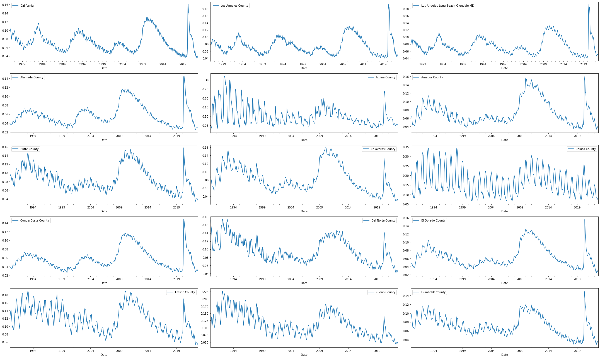

# DeepLearners-California-Unemployment


## Team members:
	Hossein Arjomandi
	Nic Prate
	Tixian Wang
	Zijian Zhen


## Problem explanations:

We are going to use California's unemployment data for the past few decades to predict the ones for the next few years.

### Dataset: [California’s Unemployment Rate ](https://data.ca.gov/dataset/local-area-unemployment-statistics-laus/resource/b4bc4656-7866-420f-8d87-4eda4c9996ed)

#### Descriptive statistics:
* [group by area name](stat/area_name_stat.txt) 
* [group by area type](stat/area_type_stat.txt)

|Feature|Description|
|:---|:---|
|||
|Month| month of data source, range from January to December
|Year| year of data source, range from 1976 to 2022
|Date| date of the data source, range from 1976/01/01 to 2022/09/01
|Area Name|categorical feature, totally 1050 different area names.
|Area Type|categorical feature, totally 6 different area types.
|Total Labor Force| number of labor force in the given area
|Employment| number of employment force in the given area
|Unemployment| number of unemployment force in the given area
|Unemployment Rate| Unemployment / Total Labor Force
|Seasonally Adjusted|whether the data is modified to eliminate the effect of seasonal and calendar influences

#### Data visualization


#### Data visualization
Here is the visualization of the historical unemployment rate of 15 selected areas in the dataset.
 

### Data Preparation:
1. Convert Year and Month into timestamps.
2. Convert categorical feature (Area Type, Area) into one-hot encoding.
3. Take Labor Force as another feature.
4. Take Unemployment Rate as target feature.

### Difficulties & some ovservations & some ideas:
1. RNN would be a good choice for times series data.
2. Each timestamp only has partial observations, how does that work in RNN? What should the data that we feed into the RNN looks like? 
3. Is that possible if we just take California data as input? 


##  Environment and Dependencies
|Package|Version|
|:---|:---|
|||
|pandas|1.3.5
|pandas-datareader|0.9.0
|sklearn|0.0
|sklearn-pandas|1.8.0
|numpy|1.21.6
|matplotlib|3.2.2
|scipy|1.4.1

To install all requirements:
```bash
pip install -r requirements.txt
```

## Project Timeline and Milestones
### Tasks on 10/23/2022:
1.  ~~Zijian: Create a repository with Readme.md as wanted~~
2. ~~Hossein: Convert rows of dataframe to objects of appropriate attributes (one hot encoded, timestamp, integer). Then we have an array of objects~~
3.  ~~Nic: See if we can convert this array of objects to a single dataframe~~
4.  ~~Tixian: See how to pickle an object, be it an array of objects or a dataframe (depending on the answer to 3rd question we may need to pickle a dataframe or an array of objects)~~


### Tasks on 11/06/2022:
1. Drop date feature for linear regression.
2. Try unemployment rate time series for each area as input for RNN
3. Try unemployment rate and labor force in time series for each area as input for RNN
4. Consider category data embedding for RNN